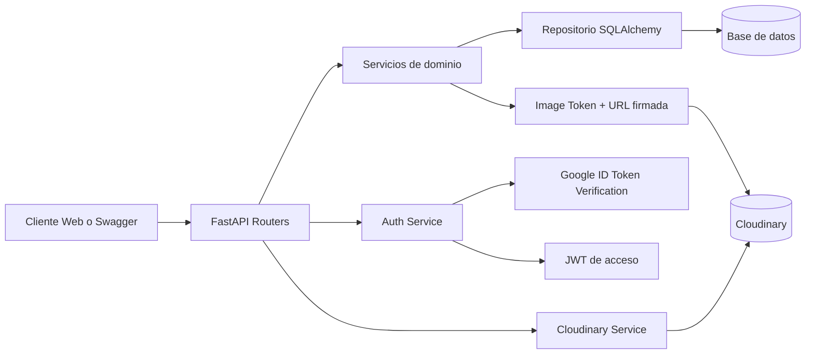

<h1 align="center">Radiography API</h1>

<p align="center">
	Backend para gestion de radiografias clinicas con autenticacion Google SSO,
	control de acceso por JWT y proteccion avanzada de imagenes.
</p>

<p align="center">
	<a href="https://www.python.org/downloads/release/python-3130/"></a>
	<a href="https://fastapi.tiangolo.com/"></a>
	<a href="https://www.sqlalchemy.org/"></a>
	<a href="https://alembic.sqlalchemy.org/"></a>
	<a href="https://cloudinary.com/"></a>
	<a href="https://radiography-api-hf8w.onrender.com/"></a>
</p>

---

## Descripcion del sistema

Radiography API es un servicio REST para registrar estudios radiograficos de pacientes y exponerlos de forma segura.

### Que resuelve

- CRUD de radiografias con datos clinicos y archivo de imagen.
- Carga de imagenes en Cloudinary.
- Acceso protegido a imagenes con token temporal ligado a usuario e imagen.
- Login con Google ID Token para autenticar usuarios.
- Versionado de base de datos con Alembic.

### Dominio principal

Cada registro de radiografia incluye:

- `full_name`
- `patient_code` (unico)
- `clinical_description`
- `study_date`
- `image_url` (oculto en respuestas publicas)
- `created_at`
- metadatos de expiracion de acceso

---

## Arquitectura funcional



---

## Instalacion y ejecucion local

### Requisitos

- Windows + PowerShell
- Python 3.13
- Variables de entorno configuradas en `.env`

### Flujo local (comandos usados)

```powershell
# Crear entorno virtual con PY 3.13
py -3.13 -m venv .venv

# Activar entorno
.venv\Scripts\Activate.ps1

# Actualizar entorno
python -m pip install --upgrade pip

# Instalar dependencias
pip install -r requirements.txt

# Migrar bd
alembic upgrade head

# Ejecutar proyecto
uvicorn app.main:app --reload
```

### URLs locales utiles

- API root: http://127.0.0.1:8000/
- Swagger UI: http://127.0.0.1:8000/docs
- Test de login Google: http://127.0.0.1:8000/google-login-test

---

## Variables de entorno clave

Ejemplo minimo para `.env`:

```env
APP_ENV=local
DATABASE_URL=
LOCAL_DATABASE_URL=sqlite:///./radiography.db

SECRET_KEY=your_secret_key
AUTH_TOKEN_KEY=your_auth_token_key
JWT_ALGORITHM=HS256

GOOGLE_CLIENT_ID=your_google_client_id

CLOUDINARY_CLOUD_NAME=your_cloud_name
CLOUDINARY_API_KEY=your_api_key
CLOUDINARY_API_SECRET=your_api_secret

ACCESS_TOKEN_EXPIRE_MINUTES=7
IMAGE_ACCESS_TOKEN_EXPIRE_MINUTES=5
SIGNED_IMAGE_URL_EXPIRE_SECONDS=120
MAX_FILE_SIZE=5242880
```

---

## Decisiones tecnicas relevantes

1. FastAPI + Pydantic v2
   API tipada, validaciones declarativas y documentacion OpenAPI automatica.

2. SQLAlchemy + patron Repository
   Separacion clara entre acceso a datos y logica de negocio para facilitar mantenimiento y pruebas.

3. Alembic para cambios de esquema
   La app no crea tablas en startup; la estructura se controla por migraciones versionadas.

4. Google SSO como identidad primaria
   Se valida el Google ID Token y luego se emite JWT propio para endpoints protegidos.

5. Seguridad por capas para imagenes
   No se expone `image_url` directamente. El acceso exige:

- usuario autenticado
- token de imagen de corta duracion
- URL firmada con expiracion y firma HMAC

6. Cloudinary para almacenamiento de imagenes
   Se externaliza el almacenamiento binario para mejorar rendimiento y simplificar despliegue.

7. Configuracion por entorno
   `DATABASE_URL` tiene prioridad; si no existe, se resuelve por `APP_ENV` (local/production).

---

## Flujo seguro de imagen (resumen)

1. Login en `/api/v1/auth/login`.
2. Generar token de imagen en `/api/v1/radiography/{item_id}/image-token`.
3. Consumir `/api/v1/radiography/{item_id}/image-access?token=...`.
4. Usar la URL firmada temporal devuelta por la API.

---

## Despliegue

- Produccion (Render): https://radiography-api-hf8w.onrender.com/

---

## Estado del proyecto

Backend operativo para pruebas locales y despliegue en nube, con foco en seguridad de acceso a imagenes medicas.
